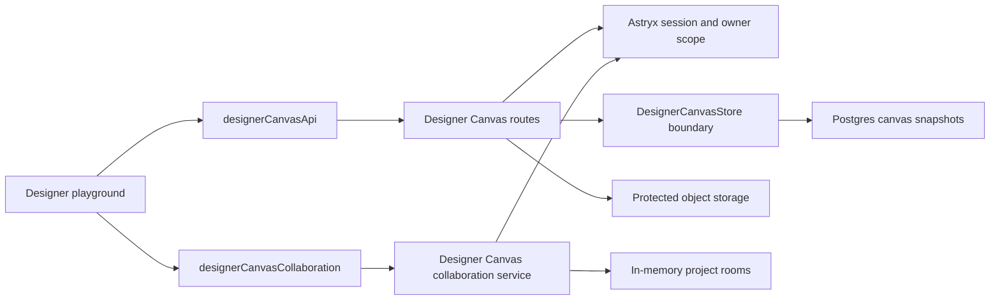

# Designer Canvas service

## Purpose

Designer Canvas is the durable workspace behind Astryx's canvas-first Project
experience. It owns canvas snapshots and embedded media independently from the
research/evidence workflow and from the current rendering engine.

Durable storage is a service boundary inside the authenticated Astryx API,
where project ownership, sessions, Postgres, and protected object storage
already live. Live collaboration is a separate WebSocket process because room
fan-out has a different scaling and failure model from durable writes.

## Contract

All routes are authenticated and owner-scoped by the project UUID.

| Method | Route | Purpose |
| --- | --- | --- |
| `GET` | `/api/designer-canvases/:projectId` | Load the latest snapshot and revision. |
| `PUT` | `/api/designer-canvases/:projectId` | Save an Excalidraw snapshot. |
| `POST` | `/api/designer-canvases/:projectId/assets/:assetId` | Store a PNG, JPEG, or WebP asset. |
| `GET` | `/api/designer-canvases/:projectId/assets/:assetId` | Read an owned protected asset. |
| `WS` | `/api/designer-canvas-collaboration?projectId=:projectId` | Join the authenticated live project room. |

Snapshot responses include a revision `ETag`. The previous
`/api/research-projects/:projectId/canvas` routes remain as compatibility
aliases during migration, but the playground uses the dedicated contract.

## Current boundaries



- The frontend serializes the document and saves only when its persistent
  fingerprint changes. Selection, open menus, zoom, and other editor-only state
  do not re-arm autosave.
- The service validates the supported snapshot envelope and normalizes an
  omitted empty `files` map.
- The store boundary is deliberately narrow: load/save a document and
  attach/read an asset. Research synthesis, comparison lanes, and catalog
  evidence are outside this service.
- Browser storage remains the offline fallback. It is not a substitute for
  authenticated remote storage.
- The collaboration service verifies the JWT Bearer credential carried in the
  WebSocket subprotocol list during upgrade and checks the project UUID through the existing owner-
  scoped project store before the socket joins a room.
- Reliable `scene` messages synchronize document changes. `cursor` messages
  are best-effort and dropped for slow peers. Embedded data URLs never enter
  the WebSocket channel; project assets continue through protected storage.
- Collaboration is additive. If the WebSocket service is unavailable, the
  editor remains fully usable and continues its existing local and remote
  snapshot saves.

## Collaboration runtime

Run the API, collaboration gateway, and frontend together in development:

```sh
npm run service:api
npm run service:designer-canvas-collab
VITRINE_API_TARGET=http://127.0.0.1:3010 \
VITRINE_CANVAS_COLLAB_TARGET=http://127.0.0.1:3012 \
VITE_RESEARCH_PROJECTS_ENABLED=true npm run dev
```

The containerized service is available through the `research` Compose profile:

```sh
docker compose --profile research up migrate api designer-canvas-collab
```

The gateway listens on port `3012` by default. Development accepts the active
loopback origin. Set `CANVAS_COLLAB_ALLOWED_ORIGINS` to a comma-separated list
of exact application origins when a stricter local gate is useful. Production
fails startup unless this value or `APP_URL` supplies an allowed origin. The
standard `npm run deploy` release runs this gateway alongside the API and
installs the same-origin Caddy WebSocket route. The browser sends the Vitrines
JWT Bearer credential through the `vitrines-bearer` subprotocol. The gateway must use the same `JWT_SIGNING_SECRET`,
`JWT_ISSUER`, and `JWT_AUDIENCE` as the API.

The service follows the useful part of `excalidraw-room`—small project rooms and
opaque scene relay—without inheriting its anonymous access, obsolete Node 12
container, or lack of Astryx project authorization. Persistence is intentionally
not performed by the room server.

## Scaling path

1. Add optimistic writes using the revision `ETag` and return `409` for stale
   saves.
2. Move the four store operations from `ResearchProjectStore` into a dedicated
   Postgres `DesignerCanvasStore` implementation while retaining the same
   project ownership join.
3. Add the Socket.IO/Redis-equivalent pub/sub adapter before running more than
   one collaboration gateway replica; the current in-memory room map is a
   deliberate single-replica boundary.
4. Add project membership roles when collaboration expands beyond multiple
   devices owned by the same user. The gateway must consume that shared access
   policy rather than creating a second permission system.
5. Consider an append-only operation log or CRDT only when offline concurrent
   editing is required. Periodic snapshots remain the fast recovery path.

## Non-goals

- Anonymous canvas writes.
- A second project identity or permission system.
- Canvas-engine-specific business data in research project records.
- Broadcasting embedded image bytes through the realtime service.
