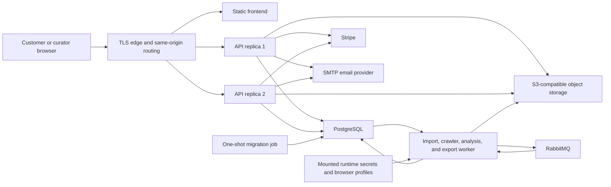

# Astryx Production Readiness Design

**Date:** 2026-07-12

**Status:** Architecture approved; implementation and production-readiness gates remain incomplete.

**Goal:** Make Astryx a launchable Free/Pro web product whose catalog, customer lifecycle, curator pipeline, evidence storage, billing, asynchronous work, deployment, and recovery behavior are proven in a production-like runtime.

## Product boundary

Astryx is an internally curated catalog of observed web application design systems for product designers. Published screens, flows, components, tokens, patterns, and design-system conclusions must remain traceable to captured evidence.

Production V1 includes public marketing and pricing, self-service customer accounts, Free and Pro subscriptions, catalog discovery and app unlocks, research and comparison tools, collections and notes, controlled exports, curator ingestion and crawling, review, immutable version publication, and secure operations.

Production V1 does not include Team or Enterprise collaboration, public user-submitted crawling, community publishing, native iOS or Android catalogs, or generated missing screens and variants.

## Non-negotiable invariants

1. **Evidence integrity:** unsupported screens, states, variants, flows, and rules stay unavailable.
2. **Draft isolation:** capture and analysis mutate an active draft; published versions are immutable snapshots.
3. **Stripe authority:** redirects never grant Pro; verified webhooks determine subscription entitlement.
4. **Server-side secrets:** customer responses, logs, artifacts, and browser bundles never contain infrastructure, Stripe, media, email, browser-profile, crawler, or test-account secrets.
5. **Durable asynchronous work:** accepting a job creates recoverable database state before the client receives success.
6. **Free and Pro only:** no organizations, seats, shared workspaces, or speculative collaboration schema.
7. **Forward-compatible releases:** application rollback must not require reversing a destructive database migration.

## Verified baseline

The current checkout is `codex/durable-intelligent-crawler`, based on commits `b367d9d` and `fa99c05` for the crawler design and plan. The dirty worktree is the implementation baseline and must not be reset or replaced.

As inspected before this design was written:

- PostgreSQL and RabbitMQ were healthy, while the frontend and API stack were not running.
- PostgreSQL contained 4 apps, 1,422 image rows, 4 app versions, 7 jobs, 2 users, and 1 active session.
- App versions consisted of 2 published versions and 2 drafts.
- Image references consisted of 1,293 `mobbin-bulk:` references and 129 `capture:` references.
- `data/images` contained 1,422 files and occupied approximately 758 MB.
- Browser profiles occupied dedicated local directories and remain operational secrets.
- 137 Node tests and 11 rendered React tests passed.
- TypeScript, the Vite build, Storybook build, Compose validation, and `git diff --check` passed.
- The main browser bundle was 615.30 kB after minification and still emitted the chunk warning.

The current implementation already contains the evidence catalog, draft and published version model, administrator and customer sessions, Free unlocks, Stripe webhook-backed subscriptions, protected media links, collections, comparisons, exports, curator review actions, RabbitMQ transport, and a deterministic smart crawler. These seams are extended rather than replaced.

## Chosen architecture

Astryx remains one repository with separately deployable frontend, API, migration, and worker artifacts. PostgreSQL is the control-plane authority, RabbitMQ is job-delivery transport, and S3-compatible object storage owns durable binary artifacts.

### Rejected approaches

- **Immediate microservice decomposition:** separate auth, billing, media, catalog, and crawler services would add network contracts and deployments without changing the V1 authority boundaries.
- **Provider-specific or serverless rewrite:** managed auth, database, queue, and storage products could shorten one deployment but would replace already working product logic and make the Playwright worker harder to operate.
- **Shared production filesystem:** local mounts cannot safely support multiple API instances, immutable releases, or independent workers.
- **General workflow engine:** the existing job and crawler lifecycles need durable state and strict transitions, not a new orchestration platform.

## Authority and component boundaries

### PostgreSQL

PostgreSQL owns relational product state, authentication state, billing projections, idempotency records, catalog drafts and versions, durable jobs, transactional outbox rows, distributed rate-limit windows, crawler plans and runs, artifact metadata, and audit records.

Schema changes are made only by ordered, checksummed migrations. API and worker startup read migration state and refuse readiness when required migrations are absent or altered. Ordinary query helpers perform no DDL.

### RabbitMQ

RabbitMQ delivers durable job notifications. Messages contain a durable job ID and non-secret routing metadata, not the authoritative workflow state. Duplicate and redelivered messages are expected. A worker transaction claims the job, validates the transition, and resumes from recorded state.

The API transaction inserts the job and an outbox row together. The worker-side dispatcher publishes unsent outbox rows and marks them sent only after broker confirmation. Publication after a crash may duplicate a message but cannot lose the accepted job.

The standalone discover service is removed unless implementation tracing identifies an independent caller that cannot use the API/outbox path.

### Object storage

An `ObjectStore` contract has a filesystem implementation for local development and an S3-compatible implementation for staging and production. Production-like staging uses MinIO.

Database records hold stable object keys, SHA-256 checksums, byte sizes, content types, creation metadata, and access classification. Evidence keys are generated from database identity and checksum rather than concatenated user input. Export and failure-artifact keys include their owning database record IDs.

Protected customer media is authorized by the API before a short-lived signed object URL is issued. Public preview access requires an explicitly ranked preview row on the latest published version. Merely existing in the bucket never makes an object public.

Existing `mobbin-bulk:` and `capture:` references remain readable during migration. A resumable migration resolves each reference, hashes the file, uploads or verifies the object, records metadata transactionally, and marks completion. Re-running is safe and checksum mismatches stop the migration.

Captured screenshots, imported Mobbin media, generated exports, crawler failure screenshots, and immutable version evidence all use the object-store contract. Writes validate an allowlisted content type, declared and measured byte size, and checksum before the database record becomes usable. Reads join through the owning app, version, export, or run so guessing an object key cannot cross an app or customer boundary.

Orphan cleanup is a mark-and-sweep operation over database references. It defaults to dry-run, reports counts and bytes, observes a grace period, and deletes only objects that remain unreferenced after a second scan. Backup, restore, retention, and storage lifecycle rules are documented and verified before cleanup is enabled in production.

Crawler profiles, storage-state files, and credentials are not media. They are mounted read-only from a dedicated secret/runtime location available only to the relevant worker.

### API

The Express API remains the product boundary and is split internally into focused routers and services as touched. It provides:

- public catalog, preview, marketing support, health, and Stripe webhook routes;
- customer registration, verification, authentication, recovery, account, session, billing, catalog, collection, note, media, and export routes;
- administrator-only version, ingestion, crawler, review, publication, retry, and DLQ controls;
- liveness, readiness, metrics, and build/release identity endpoints.

The production edge exposes the frontend and `/api` on one origin. Cookie mutations reject missing or untrusted `Origin` values, except documented non-browser callbacks such as the signed Stripe webhook. Production CORS is deny-by-default because cross-origin browser access is not a V1 requirement.

### Frontend

The React frontend uses direct URL routes with history fallback rather than hash routing. Major public, account, catalog, detail, curator, and export sections load through route-level dynamic imports. Authentication expiry and `signed_in_elsewhere` have distinct, recoverable UI states.

The existing evidence-oriented catalog remains the product core. Customer work adds registration, verification, recovery, account, sessions, billing, usage, locked, payment, offline, loading, and error states. Curator work extends the existing curator surface rather than creating a second administration application.

All new journeys are keyboard-operable, restore focus after navigation and dialogs, expose semantic labels and live status, meet launch contrast requirements, and respect reduced-motion preferences. Route-level error boundaries keep failures local and show a recoverable correlation ID. Hashed assets receive long immutable caching while the HTML shell and runtime configuration are never cached as immutable.

### Worker

One worker process can run ordinary import, caption, synthesis, crawler, and export job handlers. The implementation keeps the handlers independent while reusing the job claim, heartbeat, retry, cancellation, and structured-error lifecycle.

Mobbin and authenticated crawler jobs remain serialized per browser-profile identity. API instances scale horizontally without sharing browser state. More worker identities are added only when a second independent profile or workload proves the need.

## Database and release migrations

The migration runner maintains a `schema_migrations` ledger containing version, name, checksum, duration, and applied timestamp. It takes a PostgreSQL advisory lock, verifies every already-applied checksum, and runs each pending file in its own transaction.

The initial migration represents the exact current schema and is safe against both an empty database and the unversioned current PostgreSQL database. It preserves all existing IDs, references, snapshots, sessions, jobs, drafts, and published versions. Later migrations use expand-and-contract changes so the previous application image can run during rollout and rollback.

Production deployment order is migration job, API and worker rollout, readiness, then browser smoke tests. A failed migration rolls back its transaction and prevents application rollout. Destructive changes require a later release after old application versions no longer depend on the old shape.

## Customer identity lifecycle

Email addresses are trimmed, lowercased, and uniquely constrained in PostgreSQL. Registration, verification, login, reset request, and resend responses do not reveal whether an address is already registered.

Verification and password-reset tokens are random, single-use, purpose-bound, expiring, and stored only as hashes. Password changes consume relevant reset tokens and revoke other sessions. Sessions expose safe device metadata, can be listed and individually revoked, and retain the current two-session customer policy and `signed_in_elsewhere` behavior.

Administrator creation becomes an explicit idempotent command. It creates a missing account but never rotates an existing password or deletes sessions. Password rotation and administrator removal require separate explicit commands.

V1 provides an authenticated deletion request rather than immediate hard deletion. The account screen records the request, describes retention and billing effects, and gives a support path. Fulfilment is auditable and documented; legal retention decisions are flagged for counsel.

Staging email uses Mailpit through the same SMTP adapter used by production. Production configuration requires authenticated TLS SMTP and a verified sender.

## Billing and entitlement lifecycle

Stripe Checkout supports the server-configured monthly and yearly Pro Prices. Customer Portal access requires the Stripe customer mapping. Checkout return renders a pending reconciliation state and polls safe subscription state; it never grants entitlement locally.

Verified Stripe webhooks are idempotent and retrieve authoritative subscription state before applying changes. The projection distinguishes active, trialing if enabled by Stripe configuration, cancel-at-period-end, past-due grace, unpaid, canceled, and incomplete states. Only active or unexpired grace states receive Pro access.

The account UI shows current plan, billing interval, renewal or cancellation date, grace and payment-failure messaging, Free unlocks, and export usage. Tests cover duplicate, delayed, and out-of-order events through signed webhook payloads. A real Stripe test-mode run is performed when test credentials are supplied; deterministic signed lifecycle tests remain mandatory in CI.

## Security model

Trust boundaries are browser-to-edge, edge-to-API, API-to-PostgreSQL/object storage/Stripe/SMTP/RabbitMQ, worker-to-browser targets, and curator-to-unpublished evidence.

Controls include:

- strict production origin checks for cookie-authenticated mutations;
- Secure, HttpOnly, SameSite cookies and explicit trusted-proxy hop configuration;
- conservative JSON, webhook, upload, media, and export byte limits;
- route-boundary validation and parameterized SQL;
- generated object keys, normalized filenames, and safe content disposition;
- DNS and IP validation plus redirect revalidation for research and crawler URLs;
- PostgreSQL-backed rate-limit windows shared by every API replica;
- separate limits for registration, verification, login, reset, traversal, media, exports, and curator mutations;
- correlation IDs and generic external errors with structured redacted internal details;
- security headers, same-origin content policy, dependency audit, secret scan, and container scan;
- non-root containers, read-only root filesystems, dropped capabilities, and explicit writable temporary mounts;
- authorization tests proving customer, curator, media, collection, export, and unpublished-version isolation.

No log may include passwords, cookies, raw tokens, signed object URLs, Stripe secrets or raw sensitive payloads, browser storage state, or crawler test credentials.

## Durable jobs and intelligent crawling

Every accepted job has a database row before the API returns. Valid transitions are enforced transactionally. Jobs include attempt count, available time, lease owner, lease expiry, heartbeat, cancellation request, structured public error class, redacted internal diagnostics, and idempotency identity.

Infrastructure failures retry with bounded exponential backoff. Validation, entitlement, evidence, and semantic crawler failures are permanent unless a curator explicitly retries after correction. Abandoned leases become interrupted and recoverable. Shutdown stops new claims, lets bounded work finish, and safely requeues or releases the lease.

A RabbitMQ disconnect stops new work immediately. The worker either reconnects with bounded backoff and re-establishes confirms and consumers or exits non-zero for the runtime supervisor; it never continues under an unconfirmed channel. DLQ entries are visible through administrator-only inspection and can be retried only by an explicit action that creates a linked retry record.

The durable intelligent crawler follows the approved crawler design with one change: all crawler tables are created through versioned deployment migrations, never `ensureSchema()`. Plans are immutable by approved revision, runs resume by stable step ID, logical evidence identity prevents rerun duplication, repair creates a new unapproved revision, and failed work remains on the draft.

Atlassian remains the live acceptance target. The safe flows must pass strict postconditions. The unsafe signup flow stops before its declared side-effect boundary and uses secret names rather than literal credentials.

## Observability and operations

API and worker logs are newline-delimited JSON with timestamp, severity, service, release, request or job correlation ID, route or job type, duration, outcome, and redacted error classification.

Prometheus-compatible metrics cover HTTP volume/latency/errors, database pool state, rate-limit decisions, queue and DLQ depth, job lifecycle, crawler steps, caption/synthesis work, exports, Stripe webhooks, object access, and worker heartbeat. Metrics avoid customer identifiers and unbounded labels.

A narrow error-reporter hook receives only redacted, correlation-linked exceptions. The default implementation records structured logs; a production provider adapter may forward the same safe envelope to an error-tracking service without changing route or worker code.

Endpoints are distinct:

- startup verifies configuration and migration checksums;
- liveness proves the process event loop is responsive;
- readiness verifies required migrations, PostgreSQL, RabbitMQ for job-accepting roles, object storage, and recent worker heartbeat where applicable;
- dependency detail is administrator- or network-restricted and never exposes credentials.

Alert rules cover sustained API errors or latency, readiness loss, connection-pool exhaustion, queue age/depth, DLQ entries, stale workers, failed migrations, Stripe webhook failures, object-store errors, crawler failure rate, and backup age. Runbooks document queries and recovery actions.

Initial retention defaults are 30 days for request and application logs, 90 days for access and security events, 90 days for completed job and crawler-run diagnostics, 30 days for failure screenshots, and 7 days for downloadable export artifacts. Expired verification and reset tokens are removed after 24 hours. Backups retain 7 daily and 4 weekly copies. Counsel and the operator may lengthen required audit retention before launch; shortening it requires updating the user-facing retention disclosure and recovery analysis.

## Deployment topology

Provider-neutral production artifacts are built for:

- static frontend;
- API;
- import/crawler/analysis/export worker;
- migration and schema-check commands.

The separate discover producer is omitted unless a remaining caller proves it necessary.

The production-like staging Compose topology contains a TLS edge proxy, frontend, two API replicas, one worker, one migration job, PostgreSQL, RabbitMQ, MinIO, and Mailpit. Only the edge is publicly bound. RabbitMQ management, PostgreSQL, MinIO administration, and dependency metrics stay on internal networks.

Images use exact base-image versions, `npm ci`, multi-stage builds, production dependency pruning, non-root users, health checks, immutable release tags, and minimal copied source. Development mounts and default credentials are not accepted by production configuration validation.

Development, staging, and production load separate validated environment contracts. Staging and production refuse development origins, placeholder secrets, public dependency ports, and default PostgreSQL, RabbitMQ, MinIO, or administrator credentials.

No public production deploy, registry push, DNS change, or live-secret rotation occurs without explicit authority. Until then, completion evidence may prove local production-like staging but must list public production deployment as an external blocker.

## CI/CD and release safety

CI runs lockfile installation, diff/format checks, TypeScript, Node and rendered React tests, frontend and Storybook builds, empty and upgrade migration verification, API/worker/frontend image builds, Compose validation, dependency and secret scans, container vulnerability scans, and browser smoke tests.

Release artifacts are tagged by immutable commit SHA. Deployment gates migrations before application rollout, waits for readiness, runs same-origin browser smoke tests, and records release identity and results. Rollback selects the previous application images; database recovery is forward-fix by default and snapshot restore only for a declared disaster.

## Legal and support minimums

Launch surfaces include Terms of Service, Privacy Policy, cookie disclosure matching the actual session and Stripe behavior, billing and cancellation explanation, support contact, retention and deletion documentation, and captured-source attribution guidance.

These documents are implementation-ready disclosures, not legal approval. Counsel must decide catalog-media licensing, source attribution sufficiency, retention obligations, refund language, jurisdiction, and final Terms and Privacy wording before public launch.

## Delivery decomposition

Each slice receives its own reviewed design, implementation plan, tests, runtime evidence, and documentation reconciliation.

1. **Database foundations:** versioned migrations, startup gating, empty/upgrade fixtures, backup, restore, and current-data preservation.
2. **Object storage:** local/S3 adapters, metadata schema, signed access, explicit previews, export/failure objects, migration, lifecycle, and restore.
3. **Identity and API security:** registration, verification, recovery, sessions, admin commands, origin protection, distributed limiting, headers, SSRF, and error boundaries.
4. **Billing and customer experience:** Checkout/Portal wiring, webhook lifecycle, account/billing screens, direct routing, usage, failure states, and support/legal surfaces.
5. **Durable jobs and crawler:** transactional outbox, leases, retries, cancellation, DLQ operations, crawler persistence, curator UI, and Atlassian acceptance.
6. **Observability and runtime:** logs, metrics, health, alerting, shutdown, retention, containers, environment contract, and production-like staging.
7. **CI/CD and release:** workflows, immutable artifacts, migration gate, rollout, rollback, post-deploy smoke, and release records.
8. **Launch acceptance:** full browser matrix, customer/admin isolation, backup/restore, dependency failures, multi-instance limits, recovery drills, documentation, and final handoff.

Database foundations precede every other schema-using slice. Object storage and identity may proceed after migrations. Billing follows identity. Durable crawler work follows migrations and storage. Runtime and CI integrate the completed services, and launch acceptance is last.

## Completion evidence

Production readiness is not inferred from unit tests or image builds. The final handoff maps every supplied verification gate to an exact command, runtime record, browser artifact, query, checksum, deployment record, or documented external blocker.

The claim requires, at minimum, empty and upgrade migrations, realistic backup and restore, 1,422-file media migration with matching checksums unless the live count changes, the full automated suite, complete containerized customer and curator journeys, signed Stripe lifecycle tests, isolation and authorization tests, draft/publish failure protection, Atlassian crawler acceptance, API and worker interruption recovery, retry and DLQ proof, dependency-failure readiness, graceful shutdown, two-API distributed limiting, hardened containers, staging deploy and rollback, and final documentation reconciliation.

## Rollback and external blockers

Application rollback uses the previous immutable frontend, API, and worker images. Schema changes remain backward-compatible for at least one application release. Object migration keeps the local compatibility reader until database and checksum verification succeed; rollback selects local reads without deleting uploaded objects.

Public production deployment remains blocked until the user supplies and authorizes a hosting target, registry, DNS, TLS, Stripe test/live configuration, SMTP sender, production PostgreSQL, RabbitMQ, and object-store credentials. Legal approval remains a human decision. Neither blocker prevents implementation or complete local production-like staging.
