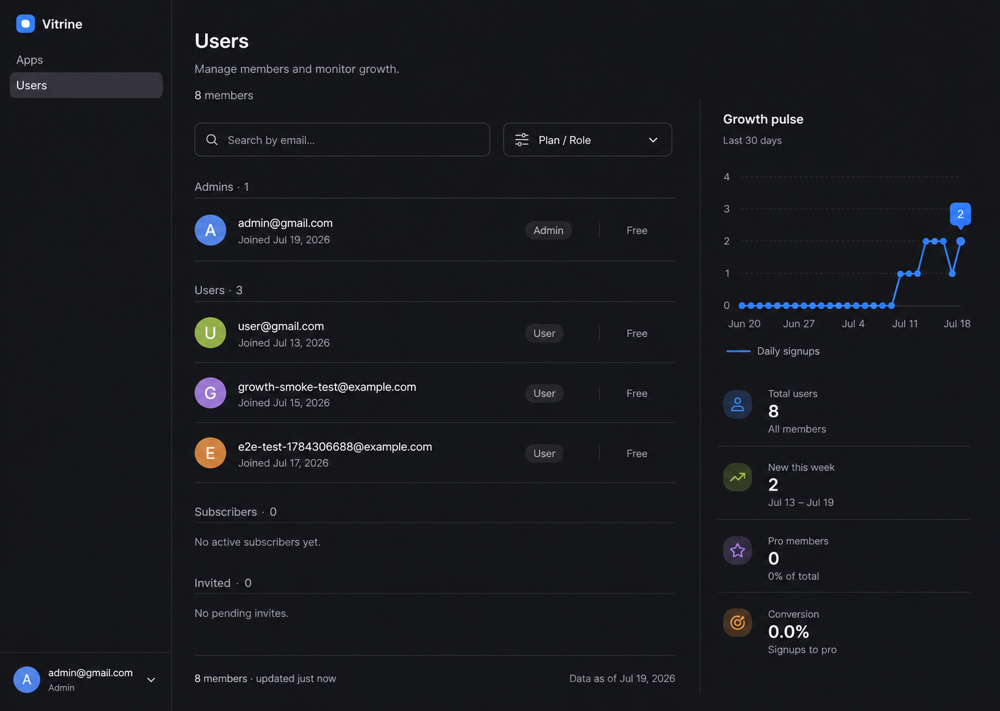

# Admin Users Page Redesign

Date: 2026-07-19  
Status: Approved visual direction (Option 2)

## Goal

Turn the read-only admin Users table into a polished, balanced workspace that lets an administrator scan members first while keeping growth health continuously visible. The redesign must preserve Astryx's existing dark visual language and use only data that the current Users APIs provide.

## Approved Visual Direction

The approved direction uses a member-first split layout:

- A broad member directory occupies roughly two-thirds of the desktop canvas.
- A narrow Growth pulse occupies the remaining third.
- Search and one compact filter sit directly above a grouped, border-light member list.
- Growth metrics are composed as typography and dividers instead of a row of dashboard cards.
- The page stays restrained: dark charcoal surfaces, one blue accent, quiet badges, thin separators, and generous spacing.

The generated reference includes concepts the current API cannot support, such as invitations and last-active timestamps. Those will not be implemented or faked.

## Scope

### In scope

- Redesign `src/vitrine/components/UsersPage.tsx` on the existing `/admin` Users surface.
- Add responsive, component-specific styles using the existing Vitrine stylesheet conventions.
- Keep the existing `/api/users` and `/api/users/growth` data flow.
- Add client-side email search and a single user-segment filter.
- Group the visible list into Administrators and Members when the unfiltered data contains both groups.
- Improve loading, empty, no-results, and error presentation without changing authentication or routing.
- Add focused tests for search, filtering, grouping, and display-value helpers.

### Out of scope

- User creation, invitation, deletion, suspension, role editing, or subscription editing.
- Bulk selection or destructive actions.
- New API routes, database columns, or migrations.
- Fabricated activity timestamps, growth deltas, or subscriber counts.
- Changes to the Apps admin surface or the global application shell.

## Information Architecture

### Page header

- Title: `Users`
- Description: `Manage members and monitor growth.`
- Supporting count: `{total} members`

The header is compact and does not repeat the large `Users & Growth` dashboard framing.

### Desktop layout

At wide viewports, the page uses a two-column split:

1. **Member directory** — flexible main column using `minmax(0, 2fr)`.
2. **Growth pulse** — secondary column using `minmax(300px, 1fr)`, separated by a subtle vertical rule.

The member directory remains the visual and reading-order priority.

### Responsive layout

- Below the desktop breakpoint, the two columns stack.
- The member directory remains first in reading order; Growth pulse follows it.
- Search and filter stack when they no longer fit side by side.
- Member metadata wraps into two lines without horizontal scrolling.
- No table layout or minimum-width grid is used, so the page remains usable on narrow screens.

## Member Directory

### Toolbar

- Search input labeled `Search members`, with placeholder `Search by email…`.
- One compact select labeled `Filter members` with these real-data options:
  - All members
  - Administrators
  - Pro members
  - Free members
  - Disabled
- A compact result count updates as search and filter values change.

Search is case-insensitive and matches email text. Filtering and search compose together.

### Grouping

For `All members`, visible users are grouped into:

- `Administrators · {count}`
- `Members · {count}`

For a narrower filter, the list uses one result group so the interface does not repeat redundant headings.

### Member row

Each row shows only fields supported by `AdminUser`:

- Deterministic initial avatar derived from the email address.
- Email as the primary label.
- `Joined {formatted date}` as secondary text.
- Role badge: Admin or User.
- Plan label: Pro for an active subscription, otherwise Free.
- Account state: Active or Disabled, represented with both text and a status dot.

Rows use spacing and thin separators rather than cell borders. Hover and keyboard-focus styles may emphasize a row, but rows are not clickable until a real detail or action flow exists.

### Empty states

- If no users exist: `No members yet.`
- If search or filtering returns no users: `No members match these filters.` plus a clear-filters action.

## Growth Pulse

The existing 30-day signup series remains the only chart. It is rendered as a compact chart with restrained grid lines and the existing Astryx blue accent.

Below the chart, show four real metrics:

- Total users
- New this week
- Pro members
- Conversion

The metrics are presented as a vertical definition list with separators, not four cards. Conversion remains `active subscribers / total users`, with an em dash when no denominator exists.

DAU, WAU, and Free unlocks are removed from this screen's primary composition because they dilute the member-management focus. Their data remains available from the API and can return in a future dedicated analytics view.

## Data Flow

`useUsersGrowth` remains the page data source and continues loading users and growth concurrently from:

- `GET /api/users`
- `GET /api/users/growth`

No server contract changes are required. Search, filtering, grouping, initials, plan labels, and date formatting are derived in the frontend from the loaded response.

The hook's existing `refresh` function is used by the error state's Retry action.

## Component Boundaries

Keep `UsersPage` as the route-level coordinator and extract small local components or pure helpers where they improve clarity:

- `MemberDirectory` — toolbar, grouping, and empty states.
- `MemberRow` — one accessible user summary.
- `GrowthPulse` — compact chart and four metric rows.
- Pure helpers for filtering, grouping, initials, plan labels, and date formatting.

These units remain private to the Users page unless another screen gains the same requirement.

## Error and Loading States

- Loading keeps a centered spinner with a stable page-height region.
- Error presentation names the failure in plain language and includes Retry.
- Retry calls the existing `refresh` function.
- A failed response never displays stale fabricated values.

## Accessibility

- Search and filter controls have persistent accessible labels.
- Active/Disabled and plan states are never conveyed by color alone.
- Group headings provide list structure for screen readers.
- Visible focus styles meet the existing blue-accent treatment.
- Text remains readable at 14–16px body sizing.
- Narrow layouts do not require horizontal scrolling.
- The chart retains a visible title and a concise accessible description of the 30-day series.

## Testing

Add focused tests that cover:

- Case-insensitive email search.
- Each filter option and combined search/filter behavior.
- Administrator/member grouping and counts.
- Active subscription to Pro mapping; all other subscription states to Free.
- Active and Disabled labels.
- Empty-list and no-filter-match messages.
- Conversion formatting with and without users.

Run the targeted Vitrine tests, the production build, and a signed-in browser check at desktop and narrow viewport widths. Compare the coded page against the approved visual target and fix visible hierarchy, spacing, wrapping, and border mismatches before handoff.

## Acceptance Criteria

- `/admin` still shows the Users surface only to authenticated admins.
- The page matches the approved Option 2 hierarchy and Astryx visual language.
- The directory is visually primary and no longer uses the design-system `Table` component.
- Search and the real-data segment filter work together without new API calls.
- Every displayed user attribute comes from the current API contract or a deterministic presentation helper.
- The growth column shows the existing 30-day series plus Total users, New this week, Pro members, and Conversion.
- The page has useful loading, error, no-user, and no-results states.
- Desktop and narrow layouts have no horizontal overflow.
- Focused tests and the production build pass.
