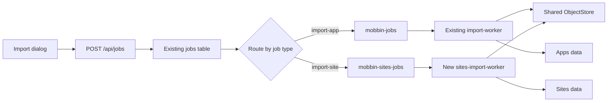
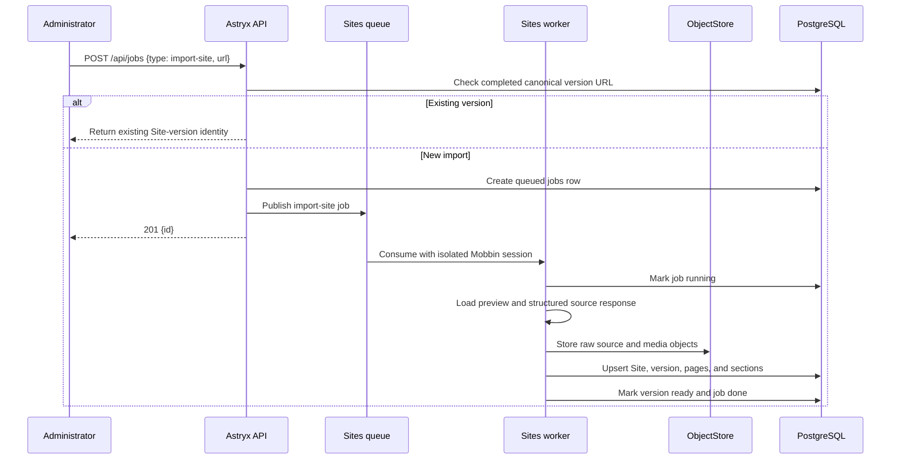

# Mobbin Sites Import Design

**Date:** 2026-07-20
**Status:** Approved design, pending implementation plan

## Goal

Add the first Astryx Sites capability: an administrator pastes one Mobbin Sites version URL, Astryx queues an import through the same control-plane architecture used by Apps, and a dedicated Sites crawler stores an inspectable Site version without sharing the existing Apps worker queue.

The first supported URL shape is:

```text
https://mobbin.com/sites/{site-id}/{version-id}/preview
```

P0 is complete when the inspected V7 fixture can be reconstructed as one Site version containing 16 pages and 46 ordered sections: 35 image sections, 11 video sections, and 3,146 OCR boxes. Its media, timing/crop metadata, and source metadata must be stored durably in Astryx.

## Product outcome

Designers gain a durable, page-by-page reference for a website instead of depending on expiring Mobbin delivery URLs or replaying one long preview video. They can inspect the full page, move through its ordered sections, and view the original image or video media for each section.

## Scope

P0 includes:

- A Sites import action following the existing Apps import-dialog interaction pattern.
- Submission through the existing authenticated `POST /api/jobs` endpoint.
- A new `import-site` job type stored in the existing `jobs` table.
- A dedicated Sites RabbitMQ queue, DLQ, worker service, browser profile, parser, and crawler.
- Persistence for Site, version, page, and ordered section records.
- Durable storage of source JSON, preview video, full-page images, and section media through the existing `ObjectStore` abstraction.
- The minimum Sites result view needed to inspect an imported version.
- Duplicate detection for an already completed Mobbin Site version URL.

P0 excludes bulk catalog discovery, automatic refresh, pattern classification, AI analysis, public sharing, GitHub sync, and replacing the existing Apps importer.

## Architecture decision

Astryx uses one RabbitMQ deployment but two isolated execution pipelines.



### Shared control plane

Sites reuses the Apps import architecture for:

- Import dialog behavior and inline submission errors.
- `requireAdmin` authorization.
- `POST /api/jobs` request handling.
- Object-storage readiness checks.
- The existing `jobs` table and `queued`, `running`, `done`, `error`, and `cancelled` states.
- The existing job cancellation and administrative monitoring surfaces.
- PostgreSQL, the RabbitMQ server, and the configured object-store backend.

There is no separate `site_import_jobs` table and no second job API.

### Isolated execution plane

Sites owns:

- Queue: `mobbin-sites-jobs`
- Dead-letter queue: `mobbin-sites-jobs.dlq`
- Service: `sites-import-worker`
- Job parser and contract: `import-site`
- Pipeline handler and crawler implementation
- Chromium user-data directory and authenticated Mobbin session
- Worker concurrency, retry behavior, logs, health, and progress namespace

The existing `mobbin-jobs` queue, Apps job union, Apps pipeline handler, and `import-worker` consumer must not consume `import-site` jobs. A Sites backlog, crash, retry storm, deployment, or expired browser session must not stop or delay Apps imports.

## Import interface

The Sites UI uses the same submission architecture as Apps, with a Sites-specific payload:

```json
{
  "type": "import-site",
  "url": "https://mobbin.com/sites/v-7-1fbe80df-2586-4a09-aa5c-29aeeb716a09/f4e176f7-aeb6-4f9a-9689-e4379fc357b1/preview"
}
```

Unlike Apps import, the form does not ask for an app slug or platform. The crawler derives the Site identity and version metadata from the source response. The API accepts only HTTPS `mobbin.com` URLs matching the supported Sites version-preview shape and applies the existing public-URL and sensitive-query protections.

For a new URL, the API creates a normal `jobs` row, publishes `{ type: "import-site", url, jobId }` through the Sites publisher, and returns `201 { id }`. If broker publication fails, it follows the Apps behavior: mark that job `error` and return `503` with a safe error message.

If the canonical version URL is already attached to a completed Site version, the API does not enqueue another crawl. It returns the existing Site-version identity so the UI can open it. If the previous attempt failed, a new job may be submitted.

The Sites page must not poll `GET /api/jobs`. Job monitoring remains on its existing administrative surface. Sites-specific live crawler telemetry, if shown, uses its own namespace and never extends the Apps progress record.

## Job routing and lifecycle

The API chooses the publisher by validated job type:

- Existing job types continue through `publishJob()` to `mobbin-jobs`.
- `import-site` goes through `publishSitesJob()` to `mobbin-sites-jobs`.

The Sites queue is durable, uses persistent messages, consumes with `prefetch(1)`, and retries transient failures up to three attempts before dead-lettering. Republish-before-ack preserves the existing at-least-once behavior, so the Sites handler must be idempotent.

The worker sets the shared job record to `running` before work and finishes it as `done`, `error`, or `cancelled`. A cancelled job is not started, and cancellation encountered during crawling stops further capture.

## Crawl and persistence flow



The worker first captures the structured source response used by the Mobbin preview, then downloads durable source assets. Transformed or encrypted delivery URLs may be recorded as provenance, but Astryx must not depend on them as its only media reference.

The imported hierarchy is:

```text
Site
└── SiteVersion
    ├── preview video
    ├── source metadata
    └── SitePage[]
        ├── full-page image
        └── SiteSection[]
            ├── image or video media
            ├── ordered position
            ├── crop or video-time boundaries
            └── OCR boxes when present
```

## Data model

### `sites`

- Stable source Site identifier
- Slug/name and display metadata
- Source URL and timestamps

### `site_versions`

- Stable source version identifier
- Parent Site
- Canonical Mobbin preview URL, unique for completed imports
- Version label/date and latest flag when supplied
- Import visibility state: `importing`, `ready`, or `failed`
- Preview-video object key
- Raw-source object key

### `site_pages`

- Stable source page identifier
- Parent Site version
- Page URL/path, title, and ordered position
- Full-page-image object key

### `site_sections`

- Stable source section identifier
- Parent page
- Ordered position
- Media kind: image or video
- Media and optional poster object keys
- Image crop boundaries or video start/end timestamps
- OCR boxes and relevant source metadata

Existing `stored_objects` remains the metadata ledger for every file. The Sites tables reference object keys rather than storing binary bytes in PostgreSQL.

## Object storage

Sites adds `video/mp4` to the supported object content types. Any increase to the current 64 MiB ceiling must remain explicit and bounded; implementation planning must choose a verified limit from the inspected source assets rather than allowing unbounded downloads.

Object keys are namespaced so they cannot collide with Apps media:

```text
sites/{siteId}/versions/{versionId}/source.json
sites/{siteId}/versions/{versionId}/preview.mp4
sites/{siteId}/versions/{versionId}/pages/{pageId}/full-page.webp
sites/{siteId}/versions/{versionId}/pages/{pageId}/sections/{sectionId}.{ext}
```

Every write retains SHA-256, byte size, content type, and access class. Imported source media is `protected`; raw source payloads are `internal`. Browser delivery continues through authorized object resolution and signed URLs.

## Consistency and duplicate handling

The crawler is idempotent by source Site ID, version ID, page ID, and section ID. Reprocessing the same RabbitMQ message must not duplicate rows or objects.

A Site version remains hidden from normal browsing while `importing`. It becomes visible only after all required page and section records are consistent and required media objects have been verified. A failed attempt may leave content-addressed objects behind, but it must not expose a partial version; orphan cleanup is outside P0.

## Error handling

- Invalid or unsupported Sites URL: reject with `400`; do not create a job.
- Object storage not ready: use the existing readiness response; do not publish.
- RabbitMQ publication failure: mark the created job `error` and return `503`.
- Expired Mobbin authentication: mark the job with a safe authentication-required error and acknowledge it without repeated retries.
- Invalid or changed source schema: fail safely, retain a bounded diagnostic source artifact, and do not expose the version.
- Network timeout, rate limit, or upstream server failure: throw as transient and retry up to three attempts.
- Missing required page or section media: fail the version rather than publishing an incomplete result.
- Worker process crash: RabbitMQ redelivers; idempotent persistence resumes without corrupting the version.
- Retry exhaustion: route only the Sites message to `mobbin-sites-jobs.dlq`.

Errors stored in jobs, logs, or diagnostics must not contain cookies, signed delivery query strings, credentials, or browser-session data.

## Verification strategy

### Contract tests

- The Sites form submits `POST /api/jobs` with `type: "import-site"` and the URL.
- Apps submissions remain unchanged.
- The API accepts the exact supported Mobbin Sites URL shape and rejects other hosts, unsafe URLs, and malformed paths.
- `import-site` creates a row in the existing `jobs` table and calls only the Sites publisher.
- The Apps publisher/parser rejects Sites jobs, and the Sites publisher/parser rejects Apps jobs.
- Broker publication failure preserves the existing `503` plus job-error behavior.

### Queue and worker tests

- The Sites queue and DLQ names are distinct from Apps.
- Sites consumption uses `prefetch(1)`, persistent messages, three-attempt retry, and dead-letter behavior.
- Running, completion, cancellation, permanent failure, and transient failure update the shared job lifecycle correctly.
- Duplicate delivery is idempotent.

### Persistence and object tests

- A saved source fixture reconstructs the inspected V7 hierarchy: 16 pages, 46 ordered sections, 35 image sections, 11 video sections, and 3,146 OCR boxes.
- All image/video section references resolve to verified stored objects.
- `video/mp4`, access classes, hashes, byte sizes, and signed delivery behave correctly.
- A failed import never appears as a ready Site version.
- Reimporting a completed canonical version URL returns the existing version and publishes no queue message.

### Boundary acceptance test

Run one Apps import and one Sites import against the same RabbitMQ deployment. Verify that each job reaches only its intended queue and consumer, the Sites result renders from Astryx-owned objects, and stopping the Sites worker does not delay or fail the Apps job.

## Deployment boundary

`docker-compose.yml` gains a separate `sites-import-worker` service with the same RabbitMQ, PostgreSQL, and object-store configuration but a separate browser-profile volume and Sites-specific worker identity. It uses `restart: on-failure` independently of `import-worker`.

Scaling or restarting one worker service must not alter the other service. P0 runs one Sites consumer because a single authenticated browser session processes one job at a time.

## Success criteria

- The existing Apps URL import remains behaviorally unchanged.
- Sites URL submission uses the same dialog/API/jobs control plane as Apps.
- `import-site` is routed only to `mobbin-sites-jobs` and `sites-import-worker`.
- The exact inspected V7 Site imports as 16 pages, 46 sections, 35 image sections, 11 video sections, and 3,146 OCR boxes.
- Required image and video media is served from Astryx object storage.
- A completed duplicate opens the existing version without a new crawl.
- Apps imports continue normally if the Sites queue is backed up or its worker is stopped.
