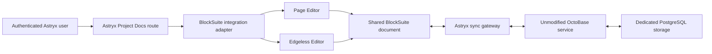

# BlockSuite + OctoBase Integration Design

**Date:** 2026-07-30

**Status:** Approved design

**Milestone:** Integration proof only

## 1. Summary

Astryx will validate a native BA/PO document workspace built with the official
BlockSuite Page Editor and full Edgeless Editor, backed by an official,
unmodified OctoBase service.

The milestone is deliberately narrow. It proves that Astryx can:

1. create a blank BlockSuite document inside an Astryx Project;
2. edit the same document through Page and Edgeless modes;
3. persist and restore its CRDT state through OctoBase; and
4. protect the experimental workspace with Astryx authentication.

This milestone does not migrate, remove, or otherwise change the existing
Feature Document workflow.

## 2. Context

The longer-term BA/PO product direction is project-scoped document management
with an AFFiNE-like combination of structured pages and an infinite canvas.
Astryx gathers and organizes user-provided information; it does not generate
document content in this workflow.

Embedding the complete AFFiNE application was rejected because Astryx requires
a commercial embedded product with seamless authentication while avoiding the
AFFiNE Enterprise backend and paid OEM licensing. Instead, Astryx will use the
open-source editing and data foundations directly:

- BlockSuite supplies Page and Edgeless editors over one block document.
- OctoBase supplies CRDT persistence and synchronization.
- Astryx retains ownership of Projects, authentication, authorization, routes,
  and the surrounding product experience.

## 3. Approved Decisions

| Area | Decision |
| --- | --- |
| Editor foundation | Official `@blocksuite/*` packages |
| Editor modes | Page Editor and the full Edgeless Editor |
| Document model | One BlockSuite document shared by both editor modes |
| Persistence | Official OctoBase service |
| Product boundary | Embedded natively inside an Astryx Project |
| Authentication | Astryx authentication protects access |
| Upstream policy | Do not fork, patch, or modify BlockSuite or OctoBase |
| Versioning | Pin exact versions and upgrade only after compatibility tests |
| Existing Feature Documents | Leave unchanged; no migration |
| Content generation | Not part of the new integration |

## 4. Goals

- Mount BlockSuite Page Editor in an authenticated Astryx Project route.
- Mount BlockSuite Edgeless Editor for the same document.
- Switch editor modes without converting or duplicating document content.
- Exercise the complete canvas toolset exposed by the selected official
  BlockSuite preset version.
- Persist CRDT changes through OctoBase.
- Restore the document and complete canvas state after a browser reload and
  service restart.
- Keep OctoBase private behind an Astryx-controlled access boundary.
- Keep all integration code inside Astryx-owned adapters and components.

## 5. Non-goals

- Migrating existing Feature Documents.
- Removing, hiding, or changing current generation features.
- Importing Notion, Confluence, or AFFiNE workspaces.
- Recreating the complete AFFiNE application shell.
- Forking or modifying BlockSuite.
- Forking or modifying OctoBase.
- Adding custom Astryx screen or Flow blocks.
- Nested page management, search, templates, favorites, or archive.
- Attachments and media upload integration.
- Revision history or read-only sharing.
- Real-time multi-user collaboration.
- Production rollout or broad visual polish.

## 6. User Experience

The proof adds an experimental Docs entry inside one Astryx Project.

```text
Project
└── Experimental Docs
    ├── Page
    └── Canvas
```

The workspace contains:

- a single blank document;
- a Page/Canvas mode switch;
- BlockSuite's official Page Editor;
- BlockSuite's official Edgeless Editor; and
- a visible save state: `Saved`, `Saving`, `Offline`, or `Save failed`.

Only the document owner can open and edit the experimental workspace in this
milestone. Shared access and collaborative editing remain out of scope.

Both editors attach to the same live BlockSuite document. Page-to-Canvas
switching does not serialize into an intermediate Astryx format and does not
create a second document.

The integration must preserve:

- rich-text and note content;
- canvas note positions;
- shapes;
- connectors;
- drawings;
- frames;
- groups;
- layer ordering; and
- canvas viewport state where the selected upstream version supports it.

Canvas-only graphical elements remain in the shared document but are not
converted into linear Page content.

## 7. Architecture



### 7.1 Frontend

An Astryx-owned integration adapter:

- initializes the BlockSuite schema and workspace;
- opens the project-scoped document;
- mounts either official editor preset;
- keeps one document instance alive while switching modes;
- connects document updates to the persistence adapter;
- reports connection and save state; and
- disposes editors and subscriptions cleanly on navigation.

BlockSuite remains an ordinary pinned dependency. Astryx does not copy its
source into the repository.

### 7.2 Astryx API and sync gateway

The browser does not receive unrestricted access to OctoBase.

The Astryx boundary:

1. authenticates the current Astryx session;
2. verifies that the current user owns the integration document in the
   requested Project;
3. maps the Astryx document ID to an OctoBase document ID;
4. issues or proxies a project-scoped sync connection; and
5. rejects cross-project document access.

The exact gateway transport may follow the supported OctoBase connector, but
the authorization decision remains in Astryx.

### 7.3 OctoBase

OctoBase runs as an unchanged, separately deployed service. It is responsible
only for BlockSuite-compatible CRDT document state and synchronization.

It is not responsible for:

- Astryx users;
- Astryx Projects;
- product navigation;
- legacy Feature Documents; or
- product-level authorization decisions.

The service uses dedicated PostgreSQL storage for the integration. It is not
publicly exposed.

## 8. Minimal Astryx Metadata

Astryx stores only the metadata needed to locate and authorize the integration
document:

```text
project_document
- id
- project_id
- owner_user_id
- title
- octobase_document_id
- last_editor_mode
- integration_version
- created_at
- updated_at
```

The CRDT block tree and canvas state remain owned by OctoBase. Astryx does not
create a second canonical copy.

The initial proof may create one document for the enabled test Project. The
schema must not assume that a Project can only ever contain one document,
because later product work may add a page tree.

## 9. Data Flow

### 9.1 Open

1. User opens the experimental Docs route.
2. Astryx authenticates the session and authorizes Project access.
3. Astryx returns scoped document connection details.
4. The integration adapter initializes one BlockSuite document.
5. The adapter connects to OctoBase and applies the current CRDT state.
6. The selected Page or Canvas editor mounts against that document.

### 9.2 Edit and save

1. User edits through Page or Canvas.
2. BlockSuite produces CRDT updates.
3. The adapter sends updates through the authorized sync boundary.
4. OctoBase persists the updates.
5. The UI reports the latest confirmed save state.

### 9.3 Switch mode

1. The current editor view is disposed without disposing the document.
2. The alternative official editor mounts against the same document instance.
3. No data conversion or duplicate persistence operation occurs.
4. Astryx records the last-used mode as lightweight metadata.

### 9.4 Reload

1. The browser recreates the BlockSuite document and reconnects.
2. OctoBase restores its persisted CRDT state.
3. The editor renders the same Page content and Canvas state.

## 10. Failure Handling

- **OctoBase unavailable:** keep unsent CRDT updates in a browser-local queue,
  display `Offline`, and retry after reconnection.
- **Save rejected:** retain the local document state, display `Save failed`, and
  provide a retry path.
- **Astryx authorization expires:** stop syncing, preserve local unsent state,
  and require re-authentication before reconnecting.
- **Cross-project access attempt:** reject before any OctoBase document state is
  returned.
- **Editor mount failure:** dispose partial editor state and expose a reload
  action without deleting the underlying document.
- **Unsupported upstream version:** fail the compatibility gate rather than
  automatically migrating stored documents.
- **Corrupt or unreadable document:** preserve the OctoBase record and make a
  diagnostic snapshot/export available; do not overwrite it with a blank
  document.

## 11. Upstream Dependency Policy

The following are prohibited:

- maintaining an Astryx fork of BlockSuite;
- maintaining an Astryx fork of OctoBase;
- editing vendored source;
- `patch-package` or equivalent runtime patching; and
- floating production dependency ranges.

Astryx extensions must use public upstream APIs and live in Astryx-owned code.
If a required capability is unavailable through supported APIs, Astryx will
build around it, defer it, or reconsider the requirement rather than patching
upstream.

Each dependency upgrade requires:

- exact-version review;
- release-note and license review;
- Page/Canvas round-trip tests;
- persistence compatibility tests;
- document restoration tests; and
- a rollback path to the previous pinned versions.

## 12. Licensing Boundary

- BlockSuite is consumed under its published MPL 2.0 license.
- OctoBase is consumed under its published AGPL-3.0 license.
- AFFiNE Enterprise backend code is not used.
- No AFFiNE OEM, white-label, SSO, or embedded application code is used.

Before production use, Astryx requires a legal review of the exact pinned
versions and the deployment boundary, especially OctoBase's AGPL-3.0
obligations. The integration proof does not claim production licensing
approval.

## 13. Known Risks

- OctoBase's official repository describes the project as under heavy
  development and not yet production-ready. The integration must assume
  breaking changes before 1.0.
- BlockSuite's extension and component APIs continue to evolve. An exact
  version must be selected from the behavior validated by the proof rather than
  from a floating latest release.
- The available Edgeless tools and persistence behavior may vary by BlockSuite
  version. Acceptance applies to the exact selected preset version.
- OctoBase and BlockSuite compatibility is a required test result, not an
  assumption based only on their shared AFFiNE origin.
- The sync gateway may need to proxy a long-lived connection. Authentication
  expiry, reconnect behavior, and resource cleanup must be validated under the
  actual supported OctoBase transport.

## 14. Verification

### 14.1 Functional checks

- Create the integration document.
- Add and edit Page content.
- Switch to Canvas and preserve Page content.
- Create and edit notes, shapes, connectors, drawings, frames, and groups.
- Switch back to Page without losing shared note content.
- Reload and restore the complete document.
- Restart OctoBase and restore the complete document.
- Reopen the Project and restore the last-used editor mode.

### 14.2 Resilience checks

- Disconnect OctoBase while editing.
- Confirm the UI reports `Offline`.
- Reconnect and confirm queued updates persist.
- Expire the Astryx session during editing.
- Attempt access from another Project.
- Interrupt a mode switch and remount the editor.
- Confirm failed recovery never replaces stored data with a blank document.

### 14.3 Compatibility checks

- Lock the exact BlockSuite package versions.
- Lock the exact OctoBase image or build version.
- Record the BlockSuite schema version used by the proof.
- Run the same saved document against any proposed upgrade in an isolated test.
- Reject an upgrade if Page, Canvas, or persistence round trips differ.

## 15. Acceptance Criteria

The milestone succeeds when:

1. an authenticated user can open the experimental Docs route in the enabled
   Astryx Project;
2. only the integration document owner can open and edit it;
3. Page and Canvas editors operate on one document;
4. switching modes loses no shared content;
5. the supported full Edgeless toolset survives reload;
6. OctoBase persists and restores CRDT state;
7. unauthorized and cross-project access is rejected;
8. BlockSuite and OctoBase remain unmodified and exactly pinned; and
9. no existing Feature Document behavior or data changes.

## 16. Rollout Boundary

The integration is enabled only for a designated test Project behind a feature
flag. It is not a production BA/PO launch.

After the proof passes, a separate design and implementation plan may address
product features such as page trees, attachments, Astryx reference blocks,
sharing, revisions, search, templates, collaboration, or broader rollout.
Those items are not implied by successful completion of this milestone.
